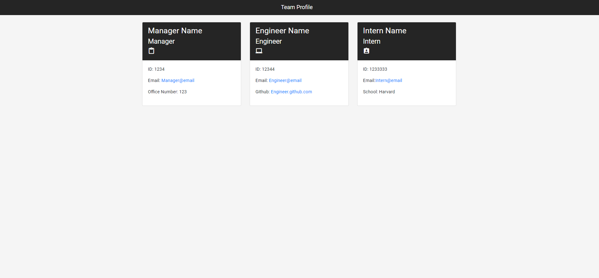

# Team Profile Generator

## Description

    a Node.js command-line application that takes in information about employees on a software engineering team, then generates an HTML webpage that displays summaries for each person.

## Built With

    Html, CSS, Js, Node, Inquirer, Jest

| Table of Contents                 |
| --------------------------------- |
| [I Installation.](#installation)  |
| [II Usage.](#usage)               |
| [III License.](#licenses)         |
| [IV Contributing.](#contributing) |
| [V Tests.](#tests)                |
| [VI Questions.](#questions)       |

## Installation

    Run npm install to get required dependencies for the project

## Usage

    Use node index.js to run the application

## Contributions

    Contributions are what make the open source community such an amazing place to learn, inspire, and create. Any contributions you make are greatly appreciated.

## Tests

    Run npm test to use all the tests developed for this app

## License

    This project is using the MIT license.

## Questions

If you have any questions about this repo please feel free to reach out to me through [GitHub](https://github.com/Wratten) or [Email](mailto:daniel.wratten@gmail.com)
